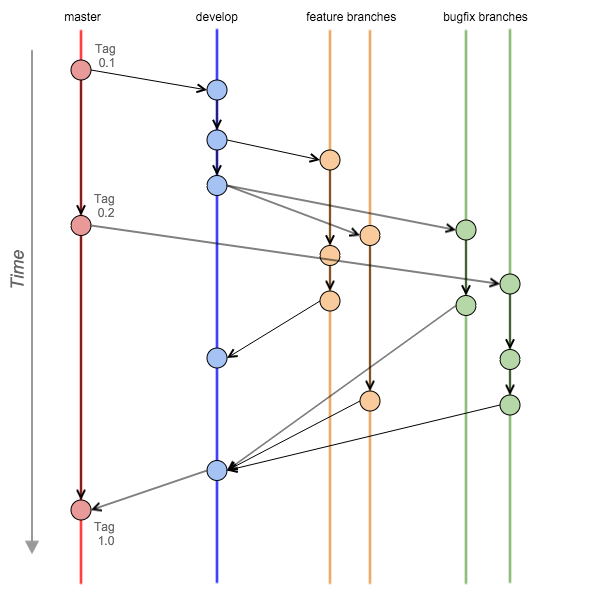

# 代码版本控制操作规范

Created by: zzp<br>
Created on: 2015年9月14日<br>
Updated on: 2016年3月19日

------

> **Note:**
>
> * 本文中，我们将所有的代码、素材、文档等统一称为**资源**，所有的资源我们都需要做版本控制，从而在团队协作过程中提高效率。

## 版本控制工具

我们统一使用 **Git** 作为资源版本控制的工具，无论使用原生的 Git 命令行，或是使用图形界面的 Git 辅助工具，都是允许的，但必须遵循下文描述的操作规范。

版本控制服务由公司内部的 **Gitlab** 服务提供，访问地址是 [http://git.our-domain.com/](http://git.our-domain.com/)。首次使用需使用工作邮箱注册账号，第一栏填写中文实名，第二栏填写自定义的用户名（纯字母可以加数字），第三行填工作邮箱，第四行是个人密码。

注册后需接收邮件，点击邮件中的链接激活用户。刚注册完成可能看不到工程，需要联系 Gitlab 管理员将账号添加到相应的组后方可。

> **Note:**
> 
> * 本文中所有Git操作采用命令行描述，使用图形界面客户端的请自行根据自己的工具进行相应的操作


## Git分支管理

因为Git是一个分布式版本控制系统，因此它并不存在一个绝对的中心库，但是在团队协作过程中我们需要指定一个**概念上的中心库**，其实就是 Gitlab，通常我们将其命名为**origin**，每个人都从这个库获取最新代码，并将最终的修改提交到这个库。

### 主要分支

我们需要在中心库保留两个生命周期无限期的主要分支：**master** 和 **develop**

* origin/master：发布分支，该分支的代码保持为稳定可发布状态，有且仅有一个人可以对该分支做 push 或 merge 操作。
* origin/develop：集成分支，所有 [支撑分支](#支撑分支) 上完成的任务通过自测后最终都要提交到develop分支，该分支的代码保持为最新状态，但该分支不能提交未完成的代码，所有未完成的任务只能在 *支撑分支* 进行。

完成的任务提交到 develop 分支后，会发布到*测试环境*，测试通过后，任务执行人在 Gitlab 上发起 **Merge Request**，由工程负责人将其 merge 到 master 分支，并打一个 **Tag** 标签，然后待发布生产环境。
> **Note:**
>
> * merge 到 master 分支的操作只有对该工程拥有 master 权限的人可以执行，通常一个工程只分配一个人有 master 权限，其他人对 master 分支仅有只读权限，以确保发布的应用的安全和稳定性。

### 支撑分支

相对于上面提到的两个主要分支，支撑分支只具有短暂的生命周期，支撑分支均由 origin/develop 分支为基础创建，并在完成分支内的任务后 merge 到 develop 分支，之后将该支撑分支删除。

主要的支撑分支如：

* 新特性分支(Freature branches)：命名规则为新特性全称，比如：`wechat_pay`
* BUG修复分支(Bugfix branches)：命名规则为`bugfix-*`(其中 * 号为 BUG 的 issue 编号)

### 工作流程



#### 新增特性

* 创建分支于：develop
* 合并分支回：develop
* 分支命名：除 master , develop , bugfix-* 之外的任何命名

Freature 分支用户开发新特性，通常不需要提交到 origin，只在开发者本地的库中创建即可，如需多人协作则提交到 origin，开发者完成开发并通过测试后将 feature 分支 merge 到 develop 分支，然后删除该 feature 分支。

示例

```
# 1. 从 develop 分支新建并切换到 newfeature 分支
$ git checkout -b newfeature develop

# 2. 进行相关开发和测试工作，commit代码
…………

# 3. 完成后，切换回 develop 分支
$ git checkout develop

# 4. 将 newfeature 中完成的内容合并回 develop 分支
$ git merge --no-ff newfeature

# 5. 删除 newfeature 分支
$ git branch -d newfeature

# 6. 将代码提交到 origin 中心库
$ git push origin develop
```

> **Note:**
> 
> * merge 时要添加 **--no-ff** 参数。因为 git 缺省的 merge 快进机制有时会造成部分有用的提交信息丢失，而 --no-ff 参数可以强制使 merge 产生一个新的 commit，从而确保 merge 进来的全部历史记录的完整性。

#### BUG修复

* 创建分支于：存在bug的分支
* 合并分支回：develop，及存在bug的分支
* 分支命名：bugfix-*（ \* 为 Bug Issue 编号）

Bugfix 分支的特点是对发布版本的 Bug 进行快速修复，并尽快发布到对应版本。因为 Bug 修复也需要一次发布，需要对该发布添加相应的子版本号。

生产环境Bug修复示例

```
# 1.创建并切换到 bugfix-1.2.1 分支
$ git checkout -b bugfix-1.2.1 master

# 2.修改版本相关元数据
…………

# 3.提交修改
$ git commit -a -m "Bumped version number to 1.2.1"

# 4.进行Bug修复相关工作，commit 修改
$ git commit -m "Fixed bla bla bla problem"

# 5.切换回 develop 分支
$ git checkout develop

# 6.合并修改
$ git merge --no-ff hotfix-1.2.1

# 7.切换到 master 分支
$ git checkout master

# 8.合并修改
$ git merge --no-ff hotfix-1.2.1

# 9.打版本标签
$ git tag -a 1.2.1

# 10.删除 hotfix 分支
$ git branch -d hotfix-1.2.1
```

## Git操作规范

### 多用 fetch 少用 pull
TODO 待补充

### 正确使用 .gitignore
TODO 待补充

