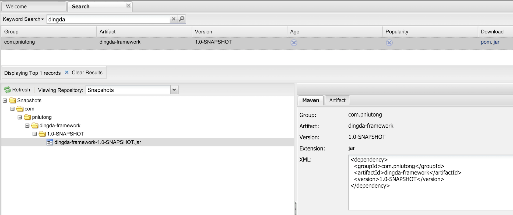

#Nexus依赖管理使用说明

为了方便开发过程中的依赖管理，公司搭建了内部 Maven 库私服，访问地址为 [http://nexus.our-domain/nexus](http://nexus.our-domain/nexus)，可直接访问该地址搜索相关依赖。


##本地Maven配置

首先要在本地安装 Maven，具体安装过程不在本文范畴内。

编辑本地 Maven 配置文件，如：~/.m2/settings.xml

编辑 **mirrors** 节点，

```
<mirrors>
    <mirror>
        <id>nexus-private</id>
        <mirrorOf>*</mirrorOf>
        <name>Private Nexus</name>
        <url>http://nexus.our-domain/nexus/content/groups/public/</url>
    </mirror>
</mirrors>
```

编辑 **profiles** 节点，

```
<profiles>
    <profile>
        <id>private</id>
        <activation>
            <jdk>1.8</jdk>
        </activation>
        <repositories>
            <repository>
                <id>nexus</id>
                <name>local private nexus</name>
                <url>http://nuxus.our-domain/nexus/content/groups/public/</url>
                <releases>
                    <enabled>true</enabled>
                </releases>
                <snapshots>
                    <enabled>true</enabled>
                </snapshots>
            </repository>
        </repositories>
        <pluginRepositories>
            <pluginRepository>
                <id>nexus</id>
                <name>local private nexus</name>
                <url>http://nuxus.our-domain/nexus/content/groups/public/</url>
                <releases>
                    <enabled>true</enabled>
                </releases>
                <snapshots>
                    <enabled>true</enabled>
                </snapshots>
            </pluginRepository>
        </pluginRepositories>
    </profile>
</profiles>
```

编辑 **activeProfiles** 节点，

```
<activeProfiles>
    <activeProfile>private</activeProfile>
</activeProfiles>
```


##工程配置

工程目前均采用 Gradle 作为构建系统，为了能够从私服获取相关依赖，并将构建好的工程产物（jar、war等）发布到 Nexus 私服，需要在工程的 **build.gradle** 中做相关配置。

引入相关插件，

```
apply plugin: 'java'
apply plugin: 'maven'
apply plugin: 'maven-publish'
```

配置 **repositories**,

```
repositories {
    mavenLocal()
    maven { url "http://nuxus.our-domain/nexus/content/groups/public/" }
    mavenCentral()
}
```

配置 **publishing**

```
publishing {
    publications {
        mavenJava(MavenPublication) {
            from components.java
        }
    }
    repositories {
        maven {
            if (project.version.endsWith('-SNAPSHOT')) {
                url "http://nuxus.our-domain/nexus/content/repositories/snapshots/"
            } else {
                url "http://nuxus.our-domain/nexus/content/repositories/releases/"
            }
            credentials {
                username "admin"
                password "admin123"
            }
        }
    }
}
```


##工程发布

构建工程并发布到 Nexus 私服可执行 `gradle publish`，如下

```
$ gradle publish

:generatePomFileForMavenJavaPublication
:compileJava
:processResources UP-TO-DATE
:classes
:jar
:publishMavenJavaPublicationToMavenRepository
Upload http://nuxus.our-domain/nexus/content/repositories/snapshots/com/dingda/dingda-framework/1.0-SNAPSHOT/dingda-framework-1.0-20160319.080653-4.jar
Upload http://nuxus.our-domain/nexus/content/repositories/snapshots/com/dingda/dingda-framework/1.0-SNAPSHOT/dingda-framework-1.0-20160319.080653-4.jar.sha1
Upload http://nuxus.our-domain/nexus/content/repositories/snapshots/com/dingda/dingda-framework/1.0-SNAPSHOT/dingda-framework-1.0-20160319.080653-4.jar.md5
Upload http://nuxus.our-domain/nexus/content/repositories/snapshots/com/dingda/dingda-framework/1.0-SNAPSHOT/dingda-framework-1.0-20160319.080653-4.pom
Upload http://nuxus.our-domain/nexus/content/repositories/snapshots/com/dingda/dingda-framework/1.0-SNAPSHOT/dingda-framework-1.0-20160319.080653-4.pom.sha1
Upload http://nuxus.our-domain/nexus/content/repositories/snapshots/com/dingda/dingda-framework/1.0-SNAPSHOT/dingda-framework-1.0-20160319.080653-4.pom.md5
Upload http://nuxus.our-domain/nexus/content/repositories/snapshots/com/dingda/dingda-framework/1.0-SNAPSHOT/maven-metadata.xml
Upload http://nuxus.our-domain/nexus/content/repositories/snapshots/com/dingda/dingda-framework/1.0-SNAPSHOT/maven-metadata.xml.sha1
Upload http://nuxus.our-domain/nexus/content/repositories/snapshots/com/dingda/dingda-framework/1.0-SNAPSHOT/maven-metadata.xml.md5
Upload http://nuxus.our-domain/nexus/content/repositories/snapshots/com/dingda/dingda-framework/maven-metadata.xml
Upload http://nuxus.our-domain/nexus/content/repositories/snapshots/com/dingda/dingda-framework/maven-metadata.xml.sha1
Upload http://nuxus.our-domain/nexus/content/repositories/snapshots/com/dingda/dingda-framework/maven-metadata.xml.md5
:publish

BUILD SUCCESSFUL

Total time: 3.257 secs
```


##使用依赖

发布到 Nexus 的工程可直接搜索到，



如此即可简单在 Gradle 中配置依赖，

```
dependencies {
    compile "com.dingda:dingda-framework:1.0-SNAPSHOT"
}
```
